# SeqAnalyze Tools
    python大作业
    Date: 2022-12-27
## 项目简介
本项目旨在开发一个基于GUI编程的蛋白质序列分析工具，实现了简单的蛋白质序列分析。主要功能包括蛋白质序列ID、序列长度、相对分子质量、疏水性、氨基酸频率、亚细胞定位、折叠速率的分析。同时实现了读取标准序列文件(.fasta/.fa)，读取用户直接以序列形式输入“Text Area”的数据，并实现了右键菜单的设计和多序列数据的分析需求。
    
    参考代码：https://github.com/PySimpleGUI/PySimpleGUI
    本项目的实现参考了PySimpleGUI发布于github的演示程序和帮助文档
## 第三方库的使用
#### PySimpleGUI:
    
    pip install PySimpleGUI
具体安装方法见：https://github.com/PySimpleGUI/PySimpleGUI)
#### biopython:

    pip install biopython
官网：http://www.biopython.org/
#### selenium:
    
    pip install selenium
官网：https://www.selenium.dev/
## 功能实现
### 主要窗口
下图展示了SeqAnalyze Tools的主要界面，点击ID、Length、Weight、Hydrophobicity等按钮可以激活对应的分析功能。

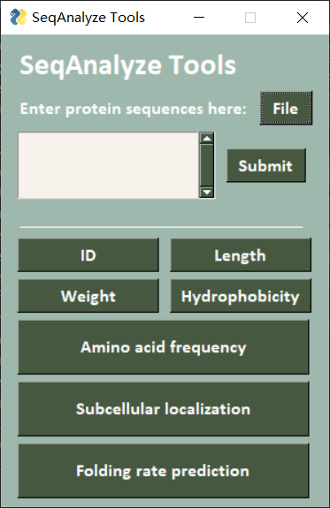  

### 文件读取
点击窗口中的“File”按钮后，激活下列文件导入窗口，点击“Browse”选择文件。  

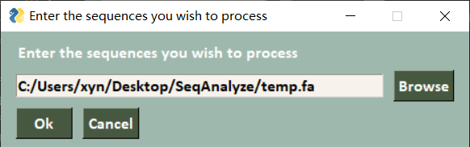  

点击窗口中“OK”成功导入temp.fasta文件(示例文件，该文件中包含2条蛋白质序列)。   

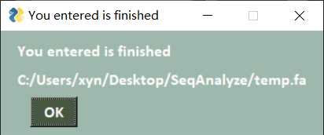  

若用户无法直接导入fasta文件，而直接在“Text Area”输入序列数据，如下图所示，要求输入时保证输入的格式标准(允许多序列输入)，单击“Submit”按钮成功导入所用序列，并在当前文件夹下将输入序列保存为temp.fa文件用于后续分析。   

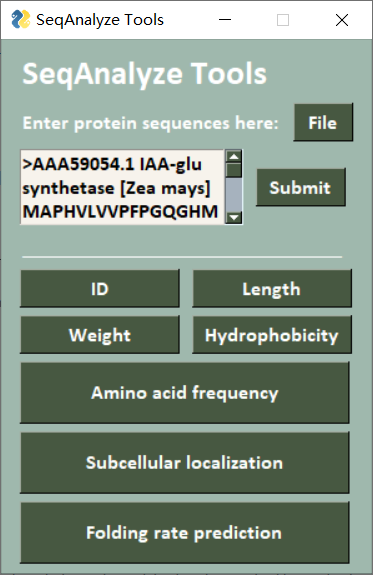  

为了便利用户的输入，本项目设计了右键菜单，实现了Copy、Paste、Cut、Select All等功能。   

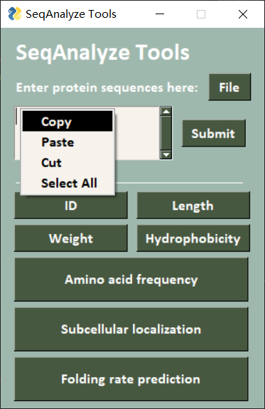
### ID
示例：导入temp.fasta示例文件，点击“ID”按钮返回序列的ID信息如下：

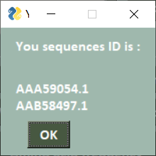  

### 序列长度
示例：导入temp.fasta示例文件，点击“Length”按钮返回序列的长度信息如下：

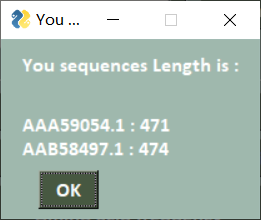  

### 相对分子质量
示例：导入temp.fasta示例文件，点击“Weight”按钮SeqAnalyze Tools将调用biopython中ProteinAnalysis进行运算，返回序列的相对分子质量信息如下：

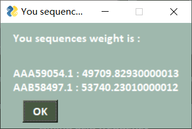  

### 疏水性
示例：导入temp.fasta示例文件，点击“Hydrophobicity”按钮基于 Hydropath. / Kyte & Doolittle 的疏水性定义，返回每个蛋白质的疏水性曲线如下：

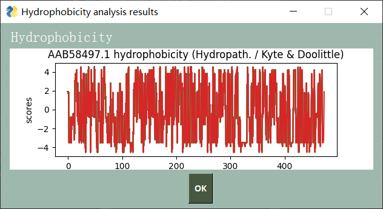  

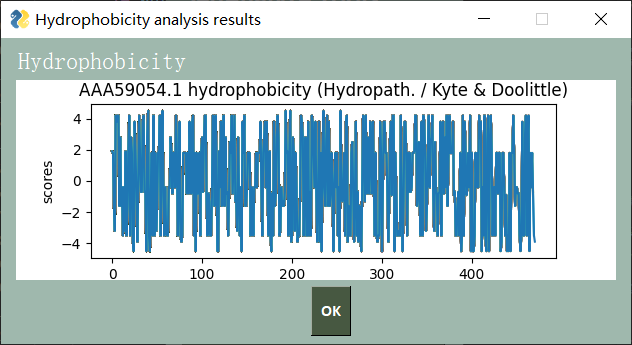  

### 氨基酸频率
示例：导入temp.fasta示例文件，点击“Amino acid frequency”按钮返回每个蛋白质的各氨基酸的频率如下：

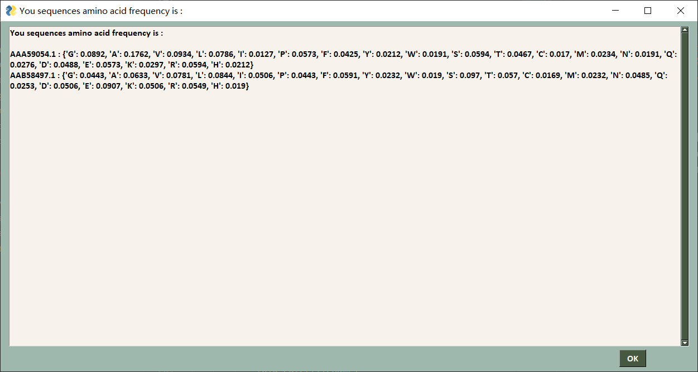  

### 亚细胞定位
示例：导入temp.fasta示例文件，点击“Subcellular localization”按钮将通过使用WoLF PSORT网站(https://wolfpsort.hgc.jp/)进行亚细胞定位分析，返回每个蛋白质的亚细胞定位。
由于WoLF PSORT网站的亚细胞定位分析需要用户选择蛋白质的生物体类型(Animal/Plant/Fungi)。SeqAnalyze Tools将会在用户进行亚细胞定位时针对每个蛋白质弹出organism_type选项框，用户可选择每个蛋白质的生物体类型如下：  

  

由于该部分基于WoLF PSORT网站分析，因此耗时较长，用户请耐心等待一段时间。  

  

注：该部分分析可能需要用户安装Chrome浏览器(压缩包中已附带chromedriver.exe文件,版本需对应，否则可能无法正常运行)。
示例分析结果如下：  

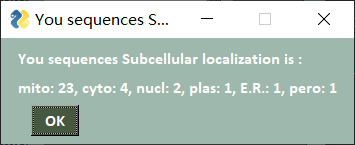  

### 折叠速率预测
示例：导入temp.fasta示例文件，点击“Folding rate prediction”按钮将通过使用FDserver网站(http://ibi.hzau.edu.cn/FDserver/cipred.php)进行蛋白质折叠速率预测，返回每个蛋白质的折叠速率如下：

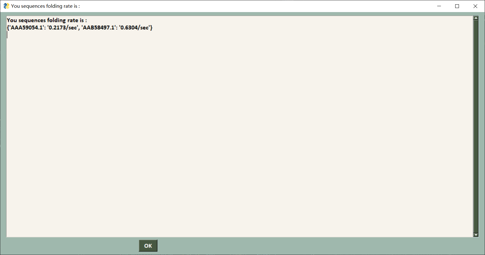

## 注意事项
1.亚细胞定位功能运行时间可能较长，请耐心等待
2.请勿输入过多条序列进行调试，可能会造成亚细胞定位运行时间过长，造成程序崩溃和服务器未响应
3.SeqAnalyze Tools允许用户输入多序列数据。若用户在text area中输入序列务必保证格式为fasta文件标准格式
4.可能需要用户安装Chrome浏览器,版本若不对应，可能无法正常运行
